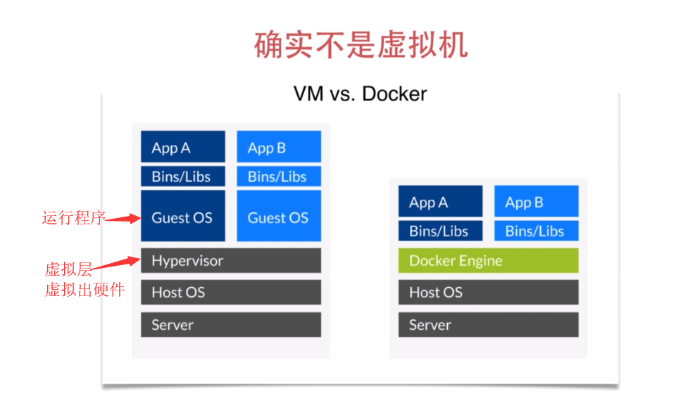

#### 1-1
docker2013年开源，是容器技术的代表。容器将程序打包隔离。容器技术的火爆是因为docker，容器技术本身不是新技术。解决痛点：开发和运维可以用同种语言来沟通
和持续集成、持续交互、微服务等等概念都是相辅相成的。
#### 1-2 Docker介绍
类比：
* 可以粗糙地理解为轻量级的虚拟机
* 开挂的chroot

在宿主机Host OS上有一层Hypervisor虚拟层，虚拟出硬件，在硬件上安装独立的Guest OS，在Guest OS中运行各种各样的程序
-------
Docker有一层Docker Engine层，在这层运行各种各样的程序，它是利用了Host OS里的namespace、control group等这些将应用程序分离。docker没有虚拟层这一层，他会比虚拟机轻量很多，内存、存储需求都会小很多
#### 1-3 docker mac 安装

#### 1-4 docker Linux 安装

#### 1-5 docker windows 安装
官网选择Windows安装即可
#### 2-1 docker架构介绍与实战
  ##### 架构
docker_host是进行docker操作的宿主机，这上运行一个叫Docker daemon(守护进程)的核心程序，Docker daemon负责docker各种各样的操作，下载docker镜像(Images)、运行容器(Containers)。通过client(客户端)使用命令和Docker daemon进行交互，将`docker build`交给Docker daemon，由Docker daemon来进行实际的操作。Docker daemon可以和Registry(镜像仓库)交互，比如说pull push一个image，是共享docker镜像的服务。
-------
  ##### 实战
运行容器：
docker运行容器之前会先看本地有没有这个image，如果没有会从远端的registry去下载
`docker run nginx`

查看本地所有images：
`docker images`
 
`docker run -p 8080:80 -d 某目录/nginx` 
运行成功之后返回一串字符串，这个是container的id
-p 端口映射 nginx80端口映射到本地host8080端口
-d 允许程序直接返回，将这个container作为守护进程来执行

查看docker 当前正在运行的container:
`docker ps`
查看docker 所有container:
`docker ps -a`
删除容器：
`docker rm containerId`

将index.html文件copy到那个nginx容器的目录中去，再打开看localhost:8080，文件改变
`docker cp index.html containerId://user/share/nginx/html`

停止容器：
`docker stop containerId`

当再打开时，修改的index.html并没有显示，而是显示了一个缺省的nginx页面。因为在容器内所做的改动都是暂时的，需要保存的话还需要另外一些操作。
在copy之后：
`docker commit -m 'fun' containerId image名字` 回车返回一长串字符串，这个是新产生的image
查看镜像：
`docker images`
删除镜像：
`docker rmi imageId`
-----------
总结：

```
docker pull  获取img
docker build 创建img
docker run   运行容器
docker stop  
docker rm   删除容器
docker ps    列出容器
docker cp   在host和container之间拷贝文件
docker images  列出img
docker rmi 删除img
docker commit 保存改动为新的img
```
#### 3-1 dockerfile介绍

#### 3-2 dockerfile实战

#### 3-3 镜像分层

#### 4-1 存储 volume介绍

#### 4-2 存储 volume操作

#### 5-1 镜像仓库 registry介绍

#### 5-2 镜像仓库 registry实战

#### 6-1 多容器app compose介绍

#### 6-2 多容器app compose-install-linux

#### 6-3 多容器app compose实战

#### 6-4 章节回顾

#### 7-1 课程总结